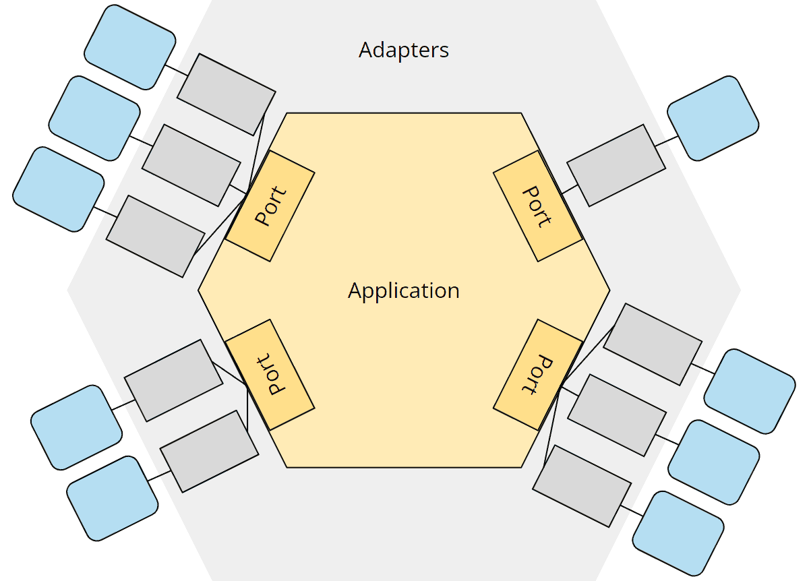
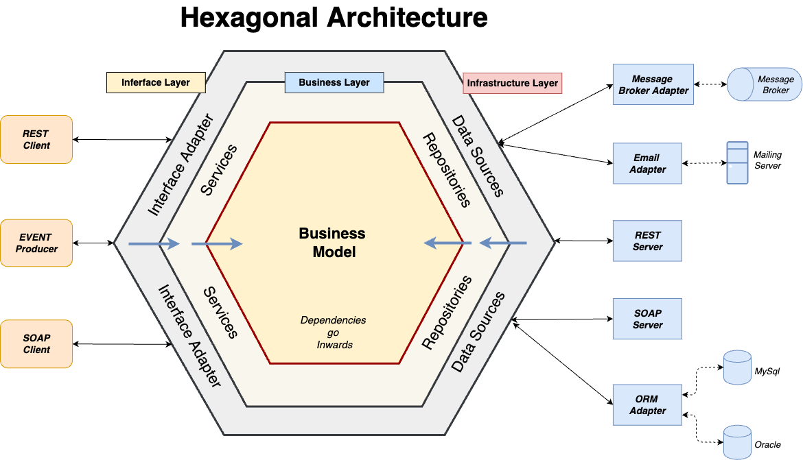

# spring-boot-hexagonal-pattern-sample





## Rest Interface

### Create
```bash
    curl --location 'http://localhost:8080/foo-service/api/customers' \
    --header 'Accept-Version: application/vnd.sample-service.v1' \
    --header 'Content-Type: application/json' \
    --data-raw '{
        "name": "Janet Yost",
        "email":"Isaac_Kilback@hotmail.com"
    }'
```
### RetrieveById
```bash
    curl --location 'http://localhost:8080/foo-service/api/customers/1' \
    --header 'Accept-Version: application/vnd.sample-service.v1'
```
### RetrieveAll
```bash
    curl --location 'http://localhost:8080/foo-service/api/customers' \
    --header 'Accept-Version: application/vnd.sample-service.v1'
```

## Grpc interface

### Create

```bash
    grpcurl --plaintext \
      -d '{"customer": {"name": "Giga Chad", "email": "email@grpc.com"}}' \
      localhost:18080 com.cjrequena.sample.grpc.service.CustomerService/CreateCustomer
```

### RetrieveById

```bash
    grpcurl --plaintext \
      -d '{"id": 1}' \
      localhost:18080 com.cjrequena.sample.grpc.service.CustomerService/RetrieveCustomerById
```

### RetrieveAll
```bash
    grpcurl --plaintext \
      localhost:18080 com.cjrequena.sample.grpc.service.CustomerService/RetrieveCustomers
```
